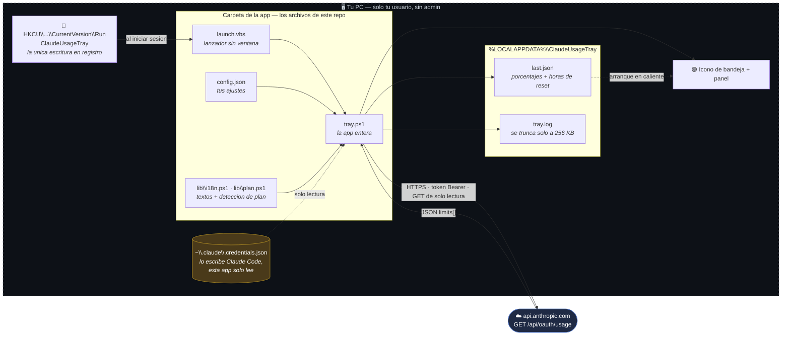
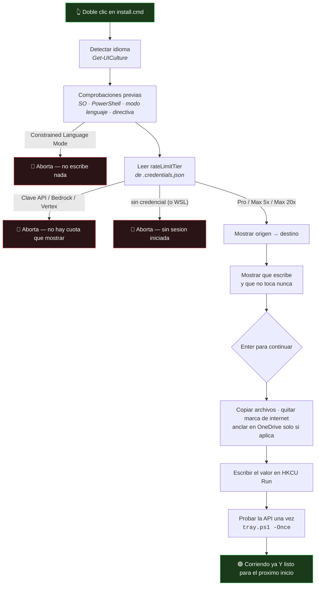
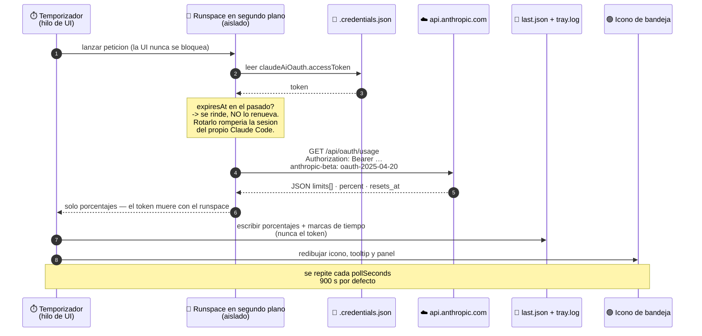
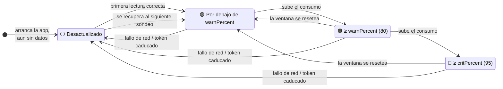
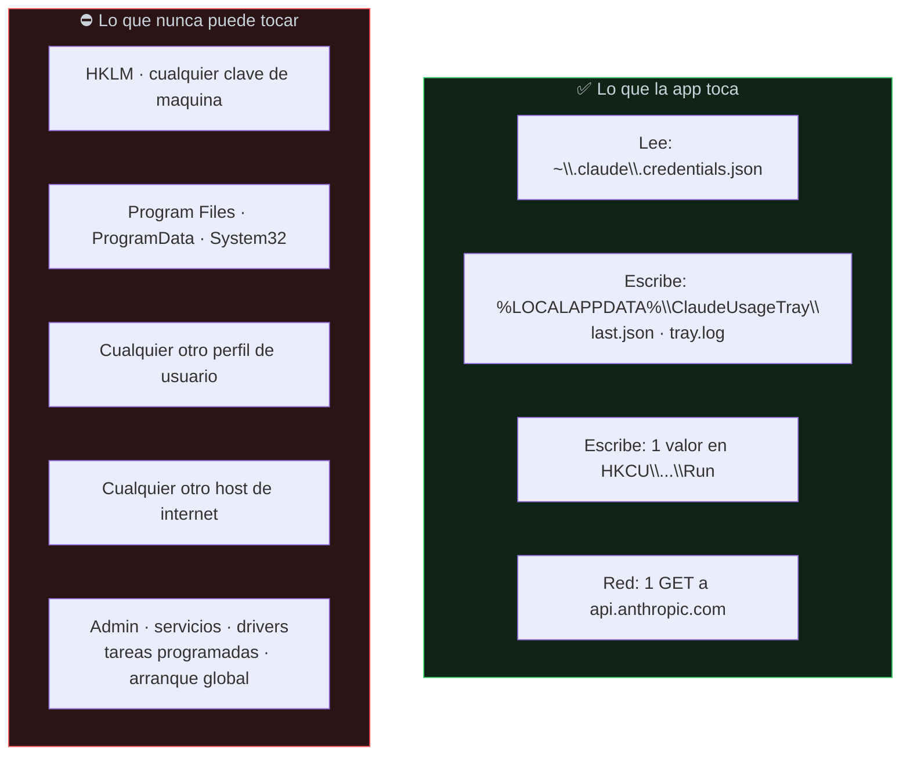
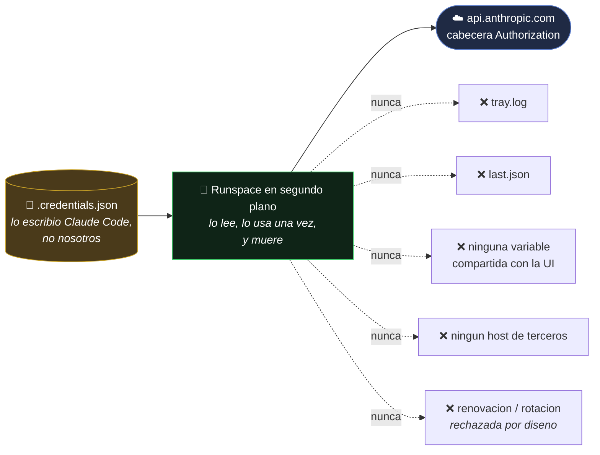

<p align="center">
  <a href="https://iaeks.com"></a>
</p>

<h3 align="center">Creado por <a href="https://iaeks.com">IA EKS</a></h3>

<p align="center">
  <b>Ingeniería de IA, automatización y herramientas a medida.</b><br/>
  Construimos las herramientas internas, agentes e integraciones que los equipos usan de verdad.<br/>
  ¿Necesitas algo así para tu stack? <a href="https://iaeks.com">Hablemos.</a>
</p>

<p align="center">
  <a href="https://iaeks.com"></a>
  <a href="https://edvardks.com"></a>
  <a href="https://www.linkedin.com/in/edvardks"></a>
</p>

<p align="center">
  <a href="LICENSE"></a>
  
  
  
</p>

---

# Claude Usage Tray

Un icono diminuto en la bandeja de Windows que muestra cuánta cuota de Claude llevas
consumida.

Dos números dibujados directamente dentro del icono de 16×16: arriba tu **sesión**
(la ventana móvil de 5 h), abajo tu **semana** (todos los modelos). Clic izquierdo
abre un panel con cada límite y su cuenta atrás hasta el reset. El color pasa de
verde a ámbar y a rojo según te acercas al tope.

Sin instalador, sin servicios, sin agentes en segundo plano, sin telemetría. Es un
único script de PowerShell que dibuja un icono.

<p align="center">
  
  &nbsp;&nbsp;&nbsp;
  
</p>

<p align="center"><i>Izquierda: el icono — sesión arriba, semana abajo, coloreado por severidad.<br/>
Derecha: un clic izquierdo abre el panel con cada límite y su cuenta atrás.</i></p>

> 🇬🇧 English version: [`README.md`](README.md)

---

## Requisitos

| Requisito | Notas |
|---|---|
| Windows 10 u 11 | Cualquier edición |
| Windows PowerShell 5.1 | Viene con Windows — nada que instalar |
| .NET Framework 4.8 | Viene con Windows — nada que instalar |
| Claude Code instalado y con sesión iniciada | La app lee la credencial que Claude Code ya guarda |
| Una suscripción Claude **Pro** o **Max** | El endpoint de uso solo existe para cuotas de suscripción |

**Cero dependencias de terceros.** Ni pip, ni npm, ni NuGet, ni binarios embebidos.
Toda la app son un puñado de scripts en texto plano que puedes leerte de una sentada.

El instalador habla **inglés y español**, elige el correcto según el idioma de tu
Windows, y puedes cambiarlo cuando quieras desde el menú de la bandeja.

### Dónde no va a funcionar

Lo digo por delante, porque el instalador prefiere negarse a instalar antes que
dejarte con un icono gris permanente:

| Situación | Por qué | Qué hace el instalador |
|---|---|---|
| **Clave de API, Bedrock o Vertex** en vez de suscripción | Se facturan por tokens y no tienen cuota de sesión ni semanal. No hay nada que mostrar. | Lo detecta, lo explica, aborta |
| **Claude Code dentro de WSL** | La credencial vive en el sistema de archivos de Linux; un proceso de Windows no llega ahí. | Detecta "sin sesión iniciada", aborta |
| **AppLocker / Constrained Language Mode** | La app necesita `Add-Type` con `DllImport` para dibujar el icono, y ese modo lo prohíbe. | Lo detecta, aborta |
| **Directiva de grupo forzando `AllSigned`** | `-ExecutionPolicy Bypass` no puede saltarse una política de máquina. | Avisa, y te remite a `trust.cmd` |
| **Cualquier cosa que no sea Windows** | WinForms y Windows PowerShell 5.1. | — |

---

## La arquitectura de un vistazo

Todo lo que hay dentro del recuadro discontinuo corre en tu máquina, bajo tu cuenta
de usuario, sin elevación. Exactamente una flecha sale de tu equipo, y va a Anthropic.



**Lo que te está diciendo este diagrama:** no hay servidor de actualizaciones, ni
endpoint de analítica, ni un segundo proceso, ni servicio, ni tarea programada, ni
escrituras fuera de tu propio perfil. Un valor de registro, dos archivos de estado,
una petición saliente.

---

## Instalación

**Doble clic en `install.cmd`.** Sin permisos de administrador, sin UAC, sin MSI, sin
elevación en ningún momento. El wizard te lleva por ocho pasos, te enseña qué ha
encontrado y qué va a hacer, y pide **una sola** confirmación antes de tocar nada.

Lo importante: te dice lo que ha encontrado *antes* de escribir nada, y se niega a
instalar en un equipo donde la app no puede funcionar.

```
  Claude Usage Tray - Instalacion
  Muestra tu cuota de Claude en la barra de Windows
  --------------------------------------------------------------

  [1/8] Idioma
      Idioma del sistema detectado: Espanol
      Pulsa E para ingles, S para espanol, o Enter para mantenerlo

  [2/8] Que hace esta app
      - Dibuja tu uso de sesion y semanal de Claude en un icono de 16x16
        en la bandeja.
      - Lee el token OAuth que Claude Code ya guardo en esta cuenta.
      - Llama a una sola direccion: api.anthropic.com. A ninguna mas, nunca.
      - Sin permisos de administrador, sin servicios, sin telemetria,
        sin codigo de terceros.

  [3/8] Comprobando este equipo
      Version de Windows         10.0.26200
      Windows PowerShell         5.1.26100.8875
      Modo de lenguaje           FullLanguage
      Directiva de ejecucion     Bypass
      Archivos de la app         ok

  [4/8] Tu plan de Claude
      Detectado: Claude Max 5x
      Nivel de limite: default_claude_max_5x

      Los limites de cuota se leen de esta suscripcion.

  [5/8] Donde se va a instalar
      Desde   D:\Descargas\claudeUsageWindows
      A       C:\Users\tu\AppData\Local\Programs\ClaudeUsageTray

      Puedes borrar la carpeta de origen despues.
      Cache y registro           C:\Users\tu\AppData\Local\ClaudeUsageTray
      Arranque automatico        HKCU\...\Run\ClaudeUsageTray

  [6/8] Que va a tocar
      Escribe en
        + ...\Programs\ClaudeUsageTray
        + ...\Local\ClaudeUsageTray
        + HKCU\...\CurrentVersion\Run\ClaudeUsageTray

      Nunca toca
        - HKLM ni ningun ajuste de toda la maquina
        - Program Files, ProgramData, System32
        - Ninguna otra cuenta de usuario de este PC
        - Ningun host que no sea api.anthropic.com

      Pulsa Enter para instalar, o Ctrl+C para cancelar

  [7/8] Instalando ...
  [8/8] Probando la conexion ...
```

### En qué plan estás

El paso 4 no es decoración. La app lee `rateLimitTier` del fichero de credenciales
que Claude Code ya escribió y te dice a qué suscripción pertenecen esos números:

| `rateLimitTier` contiene | Se muestra como |
|---|---|
| `pro` | Claude Pro |
| `max_5x` | Claude Max 5x |
| `max_20x` | Claude Max 20x |
| algo no reconocido | cae a `subscriptionType`, nunca se inventa un nombre |
| ninguna credencial | *sin sesión iniciada* — la instalación aborta |
| un entorno con clave de API | *Clave de API (sin cuota)* — la instalación aborta |

Esa misma línea aparece bajo el título del panel, así siempre sabes a qué plan se
refieren los porcentajes. Se lee en local y no cuesta ninguna petición extra.



Todos los caminos de aborto dejan la máquina exactamente como la encontraron: ningún
archivo copiado, ningún valor de registro escrito.

### Opciones de línea de comandos

| Comando | Qué hace |
|---|---|
| `install.cmd` | El wizard completo |
| `install.cmd /silent` | Sin preguntas ni pausas — sigue imprimiéndolo todo |
| `install.cmd /repair` | Repite las comprobaciones y reescribe el arranque. **Úsalo lo primero cuando algo falle.** |
| `install.cmd /inplace` | Ejecuta desde la carpeta actual en vez de copiarla — para carpetas sincronizadas entre tus equipos |
| `install.cmd /en` · `/es` | Forzar idioma |

Se combinan: `install.cmd /silent /es`.

Si no ves el icono, está en el desplegable de iconos ocultos (la flecha `^` junto al
reloj). Arrástralo fuera para fijarlo en la barra.

### Desinstalar

Doble clic en **`uninstall.cmd`**. Para el proceso y borra el valor de Run en `HKCU`,
y luego te dice dónde siguen los archivos y la caché para que los borres tú.

Desinstalar es realmente completo: un valor de registro en tu propia rama de usuario
y un proceso. Nunca se creó nada más.

---

## De dónde salen los datos

```
GET https://api.anthropic.com/api/oauth/usage
Authorization: Bearer <claudeAiOauth.accessToken>
anthropic-beta: oauth-2025-04-20
```

El token se lee de `%USERPROFILE%\.claude\.credentials.json` — el fichero que crea el
propio Claude Code al iniciar sesión. Es el mismo endpoint que hay detrás del comando
`/usage` dentro de Claude Code; la bandeja es solo una segunda vista de números que ya
tienes.

La respuesta se parsea del array `limits[]` (`kind` = `session` / `weekly_all` /
`weekly_scoped`, cada uno con `percent`, `resets_at`), con los buckets de primer nivel
`five_hour` / `seven_day` como reserva.

**La app nunca renueva ni rota el token — a propósito.** Rotar un refresh token a
espaldas de Claude Code puede invalidar su sesión y obligarte a iniciar sesión otra
vez. Si el token caduca, el icono simplemente se pone gris; abre Claude Code una vez
y se recupera en el siguiente sondeo.

El intervalo por defecto es de **15 minutos**. Puedes cambiarlo desde el menú de la
bandeja (15 s … 2 h). Por debajo de 15 s se limita.

### Un ciclo de refresco, paso a paso

Esta es la vida completa de un sondeo — y la vida completa de tu token dentro de esta
app. Fíjate en que el token se lee del disco dentro de un runspace aislado y
desaparece cuando ese runspace termina: nunca toca el hilo de la interfaz, ni la
caché, ni el log.



### Qué te está diciendo el color



Gris siempre significa "estos números son viejos", nunca "vas bien". Abre el panel —
el motivo está impreso abajo.

---

## Seguridad — qué puede y qué no puede hacer esta app

No te voy a pedir que ejecutes un script de internet sin decirte exactamente qué toca.
Todo lo de abajo se puede verificar leyendo el código.

### El radio de impacto, dibujado



La caja de la derecha no es una promesa de buen comportamiento — es la consecuencia de
que la app nunca pide elevación. Un proceso de usuario sin elevar **no puede** escribir
ahí ni queriendo, y puedes confirmar que no se pide elevación: no hay manifiesto, ni
`RunAs`, ni `Start-Process -Verb RunAs` en ninguna parte del código.

### Dónde puede y dónde no puede acabar tu token



**Red:** exactamente un host saliente, `api.anthropic.com`, un endpoint,
`GET /api/oauth/usage`, TLS 1.2. No hay servidor de actualizaciones, ni analítica, ni
reporte de fallos, ni "phone home". La única otra URL en todo el código es el crédito a
`iaeks.com` del pie del panel, que no hace nada hasta que *tú* lo pulsas y entonces
solo abre tu navegador.

**Tu token:**
- se lee dentro de un runspace aislado, se usa para una petición y se descarta;
- nunca se guarda en una variable compartida, nunca se registra en el log, nunca se
  cachea en disco;
- nunca se transmite a ningún sitio salvo en la cabecera `Authorization` hacia
  `api.anthropic.com`.

**Qué se escribe en disco** — dos ficheros bajo `%LOCALAPPDATA%\ClaudeUsageTray`:
- `last.json` — solo porcentajes y marcas de reset, para que el icono tenga algo que
  dibujar antes de la primera petición;
- `tray.log` — un log en texto plano que se trunca solo a los 256 KB.

Más un fichero en la propia carpeta de la app: `config.json`, reescrito cuando cambias
un ajuste desde el menú. Esa es la lista completa — tres ficheros.

**Registro:** un valor, `HKCU\...\CurrentVersion\Run\ClaudeUsageTray`. Nunca `HKLM`.
Nunca otra cuenta.

**Privilegios:** ninguno. Sin elevación, sin UAC, sin tarea programada, sin servicio,
sin driver. No puede instalar nada ni afectar a otros usuarios de la máquina.

**Diálogos:** ninguno, salvo que decidas ejecutar el opcional `trust.cmd` (más abajo),
que es el único sitio donde Windows te pide confirmar algo.

**Leer el fichero de credenciales** es la única operación realmente sensible de la app,
y es inevitable: el endpoint de uso exige un token OAuth. Si no te sientes cómodo con
que un script local lea un token que ya está en tu propio perfil, no ejecutes esta app
— es una postura razonable, y ninguna cantidad de revisión de código la cambia. Lo que
sí puedes verificar es que el token no va a ningún otro sitio.

### Verifícalo tú mismo, en 30 segundos

No te fíes de los diagramas. Fíate de la salida de estos comandos, ejecutados en la
carpeta de la app:

```powershell
# Todas las URL de la app. Dos resultados, y solo uno es una llamada de red:
# el endpoint de uso, mas el enlace del credito que el panel abre en TU
# navegador cuando lo pulsas.
Select-String -Path *.ps1,lib\*.ps1,*.vbs,*.cmd -Pattern 'https?://'

# Elevacion o escritura de maquina? Todos los resultados son comentarios o
# textos de interfaz diciendo que nunca lo hace. Ni RunAs, ni manifiesto,
# ni escritura en HKLM.
Select-String -Path *.ps1,lib\*.ps1,*.vbs,*.cmd -Pattern 'RunAs|HKLM|ProgramData|Program Files'

# Todas las apariciones del token. Tres: dos comprobaciones de nulo y la
# cabecera Authorization. En ningun otro sitio — ni el log, ni la cache.
Select-String -Path *.ps1,lib\*.ps1 -Pattern 'accessToken'

# Todas las escrituras a disco o registro de la app:
#   setup.ps1   el valor de HKCU Run, y las copias de la instalacion
#   tray.ps1    tray.log, la cache last.json, config.json, y de nuevo el
#               valor de Run (el conmutador "Iniciar con Windows")
#   trust.ps1   el .cer opcional que generas tu mismo
Select-String -Path *.ps1,lib\*.ps1 -Pattern 'Set-Content|Add-Content|Out-File|New-ItemProperty|WriteAllBytes|Copy-Item'
```

Y si quieres, míralo en el cable: la app hace una petición TLS cada `pollSeconds` y
nada entre medias.

### Por qué Windows puede avisarte igualmente

Los scripts no van firmados por defecto. Según tu directiva, Windows puede marcarlos, y
un certificado autofirmado no cambiaría eso: lo autofirmado no tiene reputación externa.
`trust.cmd` / `trust.ps1` están ahí para quien trabaje bajo una política `AllSigned` y
quiera firmar su copia en local. Es **opcional** y la mayoría debería saltárselo. Lee el
comentario de cabecera de `trust.ps1` antes de ejecutarlo — es sincero sobre lo que
firmar te da y lo que no.

---

## Configuración

Edita `config.json`, junto a los scripts. La app también escribe ahí tus elecciones del
menú de la bandeja.

```jsonc
{
  "pollSeconds": 900,      // intervalo de refresco; minimo 15 s
  "language": "auto",      // "auto" sigue a Windows; "en" o "es" lo fijan
  "autoUpdate": true,      // reiniciarse cuando tray.ps1 cambie en disco
  "warnPercent": 80,       // el icono se pone ambar a este consumo
  "critPercent": 95,       // el icono se pone rojo a este consumo
  "showScopedRow": true,   // mostrar tambien el limite semanal por modelo
  "iconOutline": true,     // contorno en los digitos, legible en temas claros
  "colors": {
    "normal":   "#3ED16B",
    "warning":  "#F5A623",
    "critical": "#FF5A5F",
    "stale":    "#9AA0A6"
  }
}
```

`autoUpdate` vigila la fecha de `tray.ps1` y reinicia la bandeja en menos de un minuto
si el fichero cambia. Solo recarga **el fichero local** — nunca descarga nada. Existe
para que una carpeta sincronizada entre tus propias máquinas (OneDrive, Dropbox, una
unidad de red) propague tus ediciones sin reinicios manuales.

---

## Archivos

| Fichero | Para qué |
|---|---|
| `tray.ps1` | La app entera: petición, dibujo del icono, panel, menú, temporizadores |
| `lib\i18n.ps1` | Tablas de textos en inglés y español, compartidas por app e instalador |
| `lib\plan.ps1` | Detección de plan. Lee solo metadatos — nunca el token |
| `launch.vbs` | Arranca `tray.ps1` sin parpadeo de consola |
| `install.cmd` → `setup.ps1 -Install` | El wizard (sin admin, una confirmación) |
| `uninstall.cmd` → `setup.ps1 -Uninstall` | Lo para y quita el arranque automático |
| `trust.cmd` → `trust.ps1` | Firma de código local, **opcional** |
| `config.json` | Ajustes, idioma y colores |

### Depuración

```powershell
# Una peticion, imprime el resultado y sale. Sin icono.
powershell -NoProfile -ExecutionPolicy Bypass -File .\tray.ps1 -Once

# Ejecutar con consola visible y log en vivo.
powershell -NoProfile -ExecutionPolicy Bypass -File .\tray.ps1 -Foreground

# Renderizar el icono (ampliado) y el panel a un PNG.
powershell -NoProfile -ExecutionPolicy Bypass -File .\tray.ps1 -Preview salida.png
```

El log está en `%LOCALAPPDATA%\ClaudeUsageTray\tray.log`, y el menú de la bandeja tiene
un acceso directo para abrirlo.

### Problemas frecuentes

**Ante la duda, ejecuta `install.cmd /repair`.** Repite todas las comprobaciones,
vuelve a informar de tu plan, reescribe el arranque automático y reinicia la app — sin
copiar nada ni cambiar tus ajustes. Es el punto único de diagnóstico.

| Síntoma | Causa / solución |
|---|---|
| Icono gris | Los datos son viejos. Abre el panel — el motivo está abajo. |
| `inicia sesion en Claude Code` | No hay credencial para esta cuenta de Windows. Ejecuta `/repair` para ver qué detecta. |
| `credencial caducada` | Abre Claude Code una vez. La app no renueva el token por diseño. |
| No aparece el icono | Mira el desplegable de iconos ocultos; luego mira `tray.log`. |
| No arranca al iniciar sesión | `install.cmd /repair` reescribe `HKCU\...\Run\ClaudeUsageTray`. |
| Las etiquetas salen como `menu.exit`, `reset.days`… | Falta `lib\i18n.ps1`. Vuelve a ejecutar `install.cmd`. |

---

## Hecho con IA

Esta app la diseñó y escribió **Claude** (Anthropic) como autor principal, dirigido y
revisado por una persona. Se dice por delante en vez de esconderlo, por dos razones:
mereces saber la procedencia del código que ejecutas, y es justo por eso que el código
es pequeño, comentado y legible — no deberías tener que fiarte de la palabra de nadie
sobre lo que hace, incluida la mía.

Léete `tray.ps1` antes de ejecutarlo. Es un solo fichero, y lo interesante (la llamada
de red y la lectura de la credencial) está en las primeras 220 líneas.

---

## No oficial

Sin afiliación, respaldo ni soporte de Anthropic. "Claude" es marca registrada de
Anthropic. Este proyecto usa un endpoint que no forma parte de ninguna API pública
documentada; puede cambiar o desaparecer sin aviso, y si lo hace, el icono se pone gris
y la app sigue fallando sin causar daño.

## Licencia

MIT. Libre para usar, copiar, modificar y redistribuir, comercialmente o no. Ver
[`LICENSE`](LICENSE). Se entrega tal cual, sin garantía.

---

## Autor

<a href="https://iaeks.com"></a>

Creado por **Edvard KS** en **[IA EKS](https://iaeks.com)** — ingeniería de IA,
automatización y herramientas a medida. Si tu equipo necesita herramientas internas,
agentes o integraciones bien hechas, eso es lo que hacemos.

- 🌐 **[iaeks.com](https://iaeks.com)** — qué construimos y cómo contratarnos
- 👤 **[edvardks.com](https://edvardks.com)** — web personal
- 💼 **[linkedin.com/in/edvardks](https://www.linkedin.com/in/edvardks)** — escríbeme

<br clear="left"/>

Las issues y pull requests son bienvenidas. Si esto te ha salvado de reventar un límite
a media sprint, una ⭐ en el repo es la forma más barata de decirlo.

<p align="center"><sub>developed by <a href="https://iaeks.com">iaeks.com</a></sub></p>
