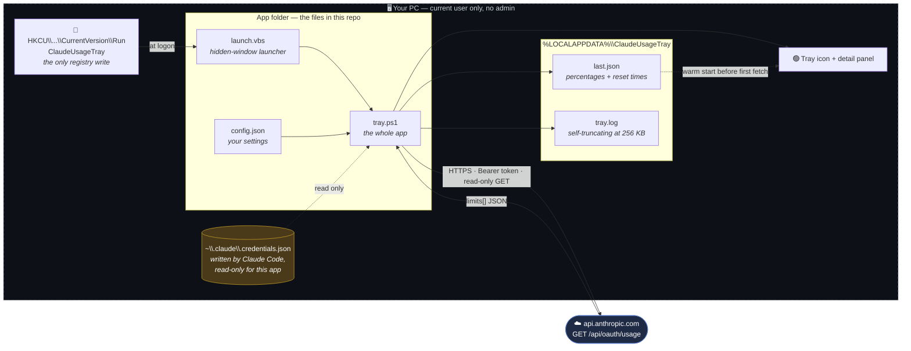
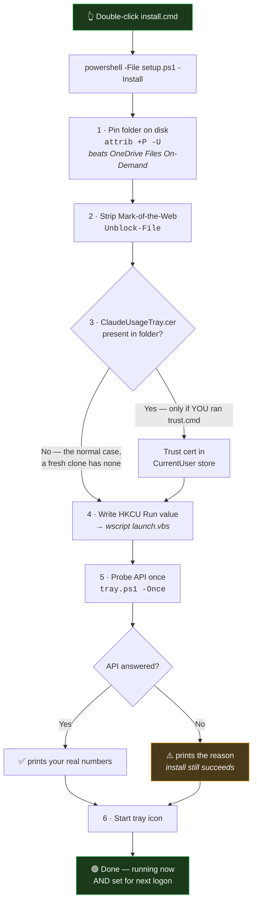
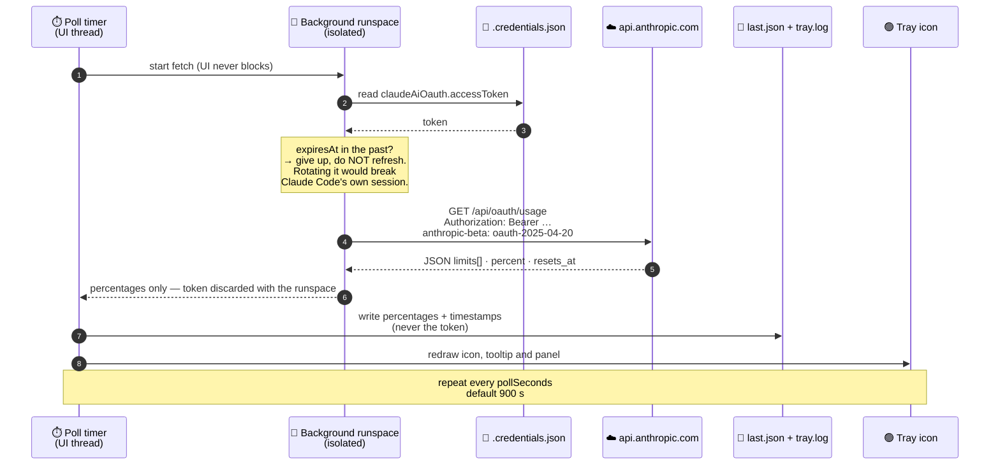
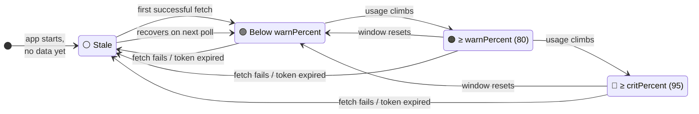
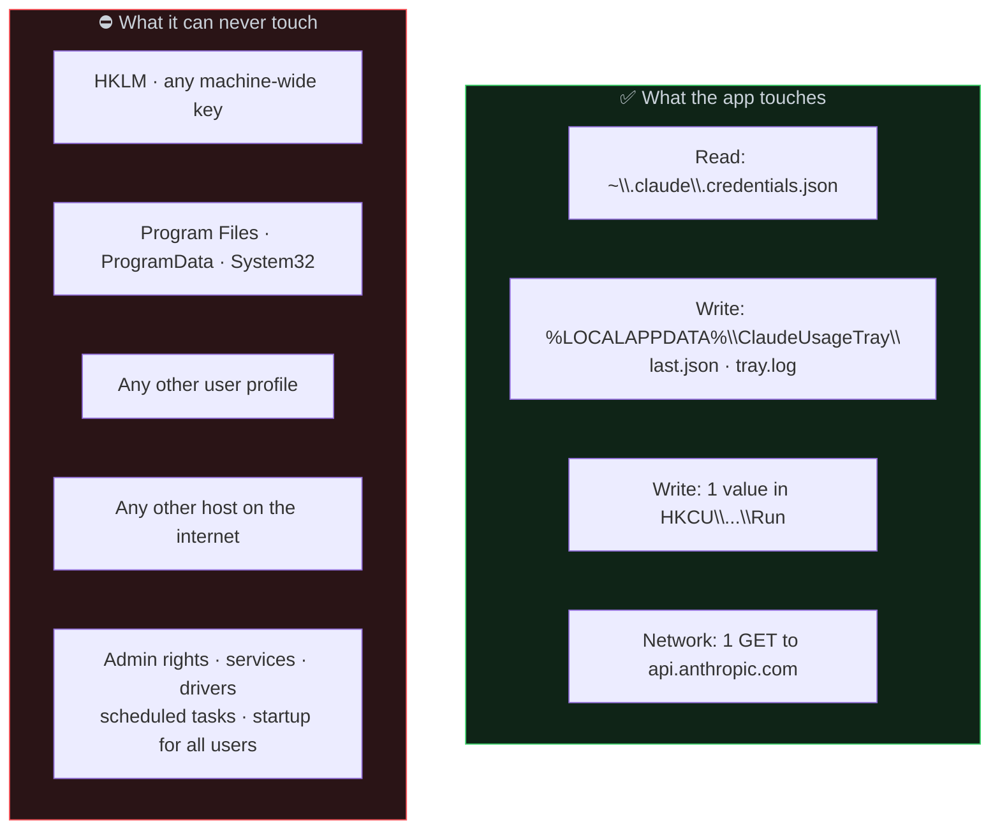
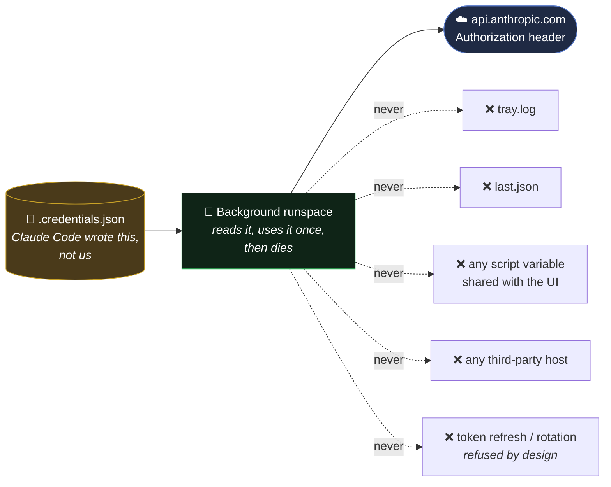

# Claude Usage Tray

A tiny Windows tray icon that shows how much of your Claude quota you have used.

Two numbers are drawn straight into the 16×16 notification-area icon: the top one
is your **session** (the rolling 5-hour window), the bottom one is your **week**
(all models). Left-click opens a small panel with every limit and its reset
countdown. The colour goes green → amber → red as you approach the cap.

No installer, no service, no background agent, no telemetry. It is a single
PowerShell script that draws an icon.

> 🇪🇸 Spanish version: [`README.es.md`](README.es.md)

---

## Requirements

| Requirement | Notes |
|---|---|
| Windows 10 or 11 | Any edition |
| Windows PowerShell 5.1 | Ships with Windows — nothing to install |
| .NET Framework 4.8 | Ships with Windows — nothing to install |
| Claude Code installed and logged in | The app reads the credential Claude Code already stores |

There are **zero third-party dependencies**. No pip, no npm, no NuGet, no vendored
binaries. The whole app is five plain-text scripts you can read in one sitting.

---

## Architecture at a glance

Everything inside the dashed box runs on your machine, under your user account,
with no elevation. Exactly one arrow leaves your machine, and it goes to
Anthropic.



**What this diagram is telling you:** there is no update server, no analytics
endpoint, no second process, no service, no scheduled task, and no writes outside
your own profile. One registry value, two state files, one outbound request.

---

## Install

**Double-click `install.cmd`. That is the entire installation.**

To be explicit about what that means, because it matters:

- It does **not** require administrator rights.
- It does **not** ask you any questions or show any prompts.
- It does **not** run an installer, MSI, or setup wizard.
- It does **not** write to `Program Files`, `HKLM`, `ProgramData`, or any other
  user's profile.
- When it finishes, the app is already running *and* already registered to start
  at your next logon. There is no second step.

What `install.cmd` actually does, in order (see `setup.ps1`, ~140 readable lines):

1. **Pins the folder** so OneDrive keeps the files on local disk (`attrib +P -U`).
   Without this, Files On-Demand could leave a cloud placeholder that Windows
   cannot start at logon.
2. **Removes the Mark-of-the-Web** (`Unblock-File`) from the folder's files, which
   is what would otherwise make Windows treat synced scripts as untrusted.
3. **Trusts the signing certificate** — *only if* a `ClaudeUsageTray.cer` sits next
   to the scripts, i.e. only if you generated one yourself with `trust.cmd`. A
   fresh clone from GitHub has no `.cer`, so this step is skipped entirely.
4. **Registers autostart** under
   `HKCU\Software\Microsoft\Windows\CurrentVersion\Run` → `ClaudeUsageTray`,
   pointing at `launch.vbs` (which starts PowerShell with a hidden window).
5. **Probes the API once** (`tray.ps1 -Once`) and prints the result, so a failure
   is visible immediately rather than as a silent missing icon.
6. **Starts the tray icon.**



No step in that chart requests elevation, opens a dialog, or contacts any host
other than `api.anthropic.com` in step 5.

If you do not see the icon, it is in the hidden-icons flyout (the `^` arrow next to
the clock). Drag it out to pin it to the taskbar.

### Uninstall

Double-click **`uninstall.cmd`**. It stops the process and deletes the `HKCU` Run
value. It intentionally leaves your files and the local cache in place; delete
`%LOCALAPPDATA%\ClaudeUsageTray` yourself if you want them gone.

Uninstalling is genuinely complete: one registry value under your own user hive and
one process. Nothing else was ever created.

---

## Where the data comes from

```
GET https://api.anthropic.com/api/oauth/usage
Authorization: Bearer <claudeAiOauth.accessToken>
anthropic-beta: oauth-2025-04-20
```

The bearer token is read from `%USERPROFILE%\.claude\.credentials.json` — the file
Claude Code itself creates when you log in. This is the same endpoint that backs
the `/usage` slash command inside Claude Code; the tray is just a second view of
numbers you already have.

The response is parsed from the `limits[]` array (`kind` = `session` /
`weekly_all` / `weekly_scoped`, each with `percent`, `resets_at`, `severity`), with
the top-level `five_hour` / `seven_day` buckets as a fallback.

**The app never refreshes or rotates the token — deliberately.** Rotating a refresh
token behind Claude Code's back can invalidate its session and force you to log in
again. If the token expires, the icon simply greys out; open Claude Code once and
it recovers on the next poll.

Default poll interval is **15 minutes**. You can change it from the tray menu
(15 s … 2 h). Anything under 15 s is clamped.

### One refresh cycle, step by step

This is the complete life of a single poll — and the complete life of your token
inside this app. Note that the token is read fresh from disk inside an isolated
background runspace and is gone when that runspace ends: it never touches the UI
thread, the cache, or the log.



### What the colour is telling you



Grey always means "these numbers are old", never "you are fine". Open the panel —
the reason is printed at the bottom.

---

## Security — what this app can and cannot do

I would not ask you to run a script off the internet without telling you exactly
what it touches. Everything below is verifiable by reading the source.

### The blast radius, drawn



The right-hand box is not a promise of good behaviour — it is a consequence of the
app never requesting elevation. A non-elevated user process **cannot** write there
even if it tried, and you can confirm no elevation is requested: there is no
manifest, no `RunAs`, no `Start-Process -Verb RunAs` anywhere in the source.

### Where your token can and cannot go



**Network:** exactly one outbound host, `api.anthropic.com`, one endpoint,
`GET /api/oauth/usage`, TLS 1.2. `grep -i 'http' tray.ps1` returns that single URL
and nothing else. There is no update server, no analytics, no crash reporter, no
"phone home".

**Your token:**
- read inside an isolated background runspace, used for one request, discarded;
- never stored in a shared script variable, never logged, never cached to disk;
- never transmitted anywhere except in the `Authorization` header to
  `api.anthropic.com`.

**What is written to disk** — two files, both under `%LOCALAPPDATA%\ClaudeUsageTray`:
- `last.json` — percentages and reset timestamps only, so the icon has something to
  draw before the first fetch completes;
- `tray.log` — a plain-text activity log, self-truncating at 256 KB.

Plus one file in the app folder itself: `config.json`, rewritten when you change a
setting from the tray menu. That is the complete list — three files.

**Registry:** one value, `HKCU\...\CurrentVersion\Run\ClaudeUsageTray`. Never
`HKLM`. Never another account.

**Privileges:** none. No elevation, no UAC prompt, no scheduled task, no service,
no driver. It cannot install anything and cannot affect other users of the machine.

**Prompts and dialogs:** none, unless you choose to run the optional `trust.cmd`
(see below), which is the one place Windows asks you to confirm something.

**Reading the credential file** is the app's one genuinely sensitive operation, and
it is unavoidable: an OAuth token is what the usage endpoint requires. If you are
not comfortable with a local script reading a token that already sits in your own
profile, do not run this app — that is a reasonable position, and no amount of code
review changes it. What you *can* verify is that the token goes nowhere else.

### Verify all of the above yourself, in 30 seconds

Do not trust the diagrams. Trust the output of these commands, run in the app
folder:

```powershell
# Every URL in the app. Expect exactly one line: api.anthropic.com
Select-String -Path *.ps1,*.vbs,*.cmd -Pattern 'https?://'

# Any elevation or machine-wide write? The only hit is the comment in
# setup.ps1 line 8 saying it never does one.
Select-String -Path *.ps1,*.vbs,*.cmd -Pattern 'RunAs|HKLM|ProgramData|Program Files'

# Everywhere the token appears. Two hits: a null check, and the Authorization
# header. Nowhere else.
Select-String -Path tray.ps1 -Pattern 'accessToken'

# Every write to disk or registry in the whole app. Seven hits, all accounted for:
#   setup.ps1:122  HKCU Run value          tray.ps1:851  same value, from the menu toggle
#   tray.ps1:92/94 tray.log                tray.ps1:285  last.json cache
#   tray.ps1:873   your config.json        trust.ps1:83  the optional .cer you generate
Select-String -Path *.ps1 -Pattern 'Set-Content|Add-Content|Out-File|New-ItemProperty|WriteAllBytes'
```

Then watch it on the wire if you want: the app makes one TLS request every
`pollSeconds` and nothing in between.

### Why Windows may still warn you

The scripts are unsigned by default. Depending on your policy, Windows may flag
them, and a self-signed certificate would not change that: self-signed carries no
external reputation. `trust.cmd` / `trust.ps1` are provided for people running
under an `AllSigned` execution policy who want to sign their own copy locally. It
is **optional** and most people should skip it. Read the header comment in
`trust.ps1` before running it — it is candid about what signing does and does not
buy you.

---

## Configuration

Edit `config.json` next to the scripts. The app also writes your tray-menu choices
back into this file.

```jsonc
{
  "pollSeconds": 900,      // refresh interval; clamped to a 15 s minimum
  "autoUpdate": true,      // restart itself when tray.ps1 changes on disk
  "warnPercent": 80,       // icon turns amber at this usage
  "critPercent": 95,       // icon turns red at this usage
  "showScopedRow": true,   // show the per-model weekly limit too
  "iconOutline": true,     // outline the digits for readability on light themes
  "colors": {
    "normal":   "#3ED16B",
    "warning":  "#F5A623",
    "critical": "#FF5A5F",
    "stale":    "#9AA0A6"
  }
}
```

`autoUpdate` watches `tray.ps1`'s timestamp and restarts the tray within a minute
of the file changing. It only ever reloads **the local file** — it never downloads
anything. It exists so that a folder synced across your own machines (OneDrive,
Dropbox, a network share) propagates your own edits without manual restarts.

---

## Files

| File | Purpose |
|---|---|
| `tray.ps1` | The whole app: fetch, icon rendering, detail panel, menu, timers |
| `launch.vbs` | Starts `tray.ps1` with no console window flash |
| `install.cmd` → `setup.ps1 -Install` | One-click install (no admin, no prompts) |
| `uninstall.cmd` → `setup.ps1 -Uninstall` | Stops it and removes autostart |
| `trust.cmd` → `trust.ps1` | **Optional** local code signing |
| `config.json` | Settings and colours |

### Debugging

```powershell
# Fetch once, print the parsed result, exit. No tray icon.
powershell -NoProfile -ExecutionPolicy Bypass -File .\tray.ps1 -Once

# Run with a visible console and live log.
powershell -NoProfile -ExecutionPolicy Bypass -File .\tray.ps1 -Foreground

# Render the icon (magnified) and the panel to a PNG.
powershell -NoProfile -ExecutionPolicy Bypass -File .\tray.ps1 -Preview out.png
```

The log lives at `%LOCALAPPDATA%\ClaudeUsageTray\tray.log`, and the tray menu has a
shortcut to open it.

### Troubleshooting

| Symptom | Cause / fix |
|---|---|
| Icon is grey | Data is stale. Open the panel — the reason is at the bottom. |
| `no-credentials` | Claude Code has not been logged in on this account. |
| `token-expired` | Open Claude Code once. The app will not refresh the token by design. |
| No icon at all | Check the hidden-icons flyout; then check `tray.log`. |
| Nothing starts at logon | Confirm `HKCU\...\Run\ClaudeUsageTray` exists; re-run `install.cmd`. |

---

## Built with AI

This app was designed and written with **Claude** (Anthropic) as the primary
author, directed and reviewed by a human. That is stated up front rather than
buried, for two reasons: you deserve to know the provenance of code you run, and
it is exactly why the source is small, commented, and readable — you should not
have to take anyone's word for what it does, including mine.

Read `tray.ps1` before you run it. It is one file, and the interesting parts (the
network call and the credential read) are in the first 210 lines.

---

## Unofficial

Not affiliated with, endorsed by, or supported by Anthropic. "Claude" is a
trademark of Anthropic. This project uses an endpoint that is not part of any
documented public API; it can change or disappear without notice, and if it does,
the icon greys out and the app keeps failing harmlessly.

## Licence

MIT. Free to use, copy, modify, and redistribute, commercially or otherwise. See
[`LICENSE`](LICENSE). Provided as-is, with no warranty.
