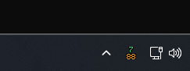
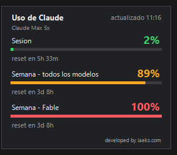
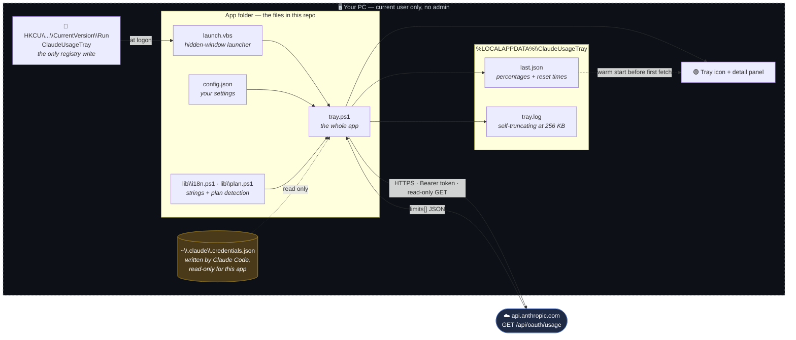
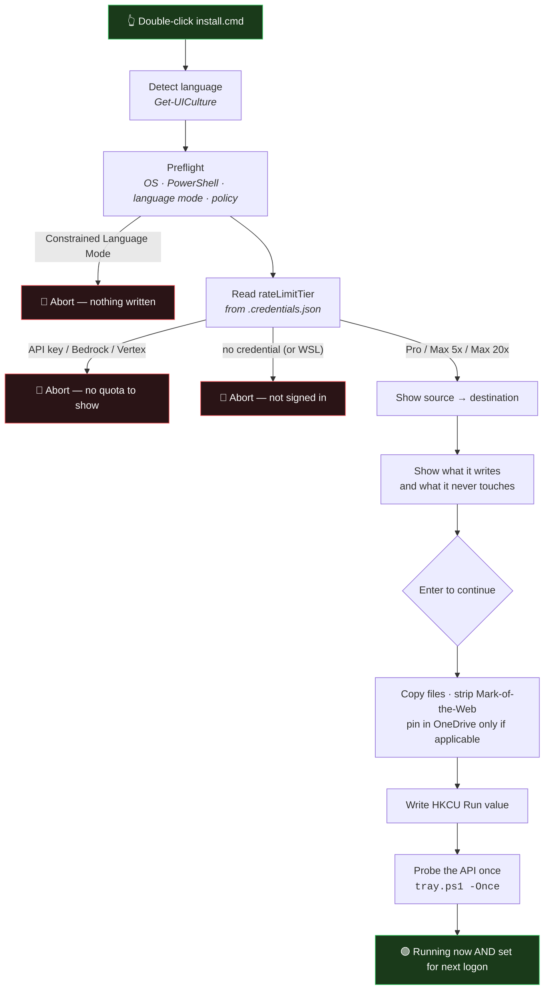
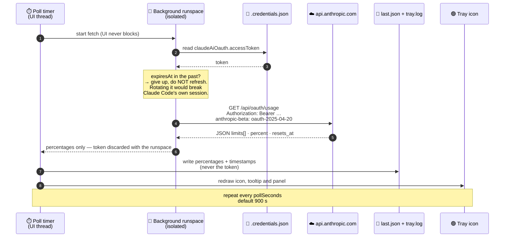
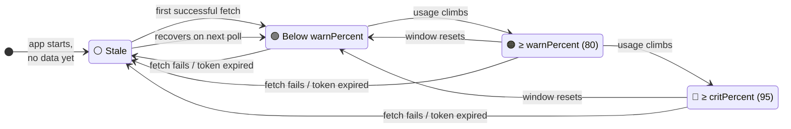
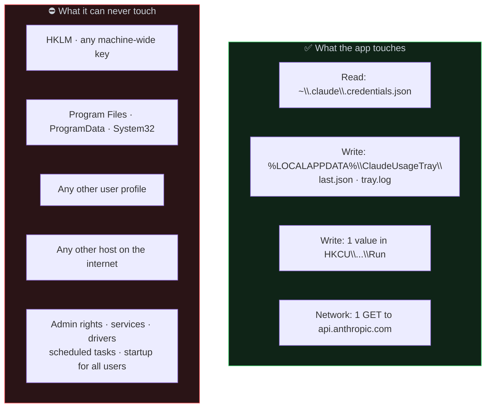

# Claude Usage Tray

A tiny Windows tray icon that shows how much of your Claude quota you have used.

Two numbers are drawn straight into the 16×16 notification-area icon: the top one
is your **session** (the rolling 5-hour window), the bottom one is your **week**
(all models). Left-click opens a small panel with every limit and its reset
countdown. The colour goes green → amber → red as you approach the cap.

No installer, no service, no background agent, no telemetry. It is a single
PowerShell script that draws an icon.

<p align="center">
  
  &nbsp;&nbsp;&nbsp;
  
</p>

<p align="center"><i>Left: the icon itself — session on top, week below, coloured by severity.<br/>
Right: one left-click opens the panel with every limit and its reset countdown.</i></p>

> 🇪🇸 Spanish version: [`README.es.md`](README.es.md)

---

## Requirements

| Requirement | Notes |
|---|---|
| Windows 10 or 11 | Any edition |
| Windows PowerShell 5.1 | Ships with Windows — nothing to install |
| .NET Framework 4.8 | Ships with Windows — nothing to install |
| Claude Code installed and logged in | The app reads the credential Claude Code already stores |
| A Claude **Pro** or **Max** subscription | The usage endpoint only exists for subscription quotas |

There are **zero third-party dependencies**. No pip, no npm, no NuGet, no vendored
binaries. The whole app is a handful of plain-text scripts you can read in one sitting.

The installer speaks **English and Spanish**, picks the right one from your Windows
UI language, and you can switch it any time from the tray menu.

### Where it will not work

Being upfront about this, because the installer refuses to install rather than
leaving you with a permanently grey icon:

| Situation | Why | Installer behaviour |
|---|---|---|
| **API key, Bedrock or Vertex** instead of a subscription | Those are billed per token and have no session or weekly quota. There is nothing to display. | Detects it, explains it, aborts |
| **Claude Code inside WSL** | The credential lives in the Linux filesystem; a Windows process cannot reach it. | Detects "not signed in", aborts |
| **AppLocker / Constrained Language Mode** | The app needs `Add-Type` with `DllImport` to draw the icon, which that mode forbids. | Detects it, aborts |
| **Group policy forcing `AllSigned`** | `-ExecutionPolicy Bypass` cannot override a machine policy. | Warns, and points you at `trust.cmd` |
| **Anything that is not Windows** | WinForms and Windows PowerShell 5.1. | — |

---

## Architecture at a glance

Everything inside the dashed box runs on your machine, under your user account,
with no elevation. Exactly one arrow leaves your machine, and it goes to
Anthropic.



**What this diagram is telling you:** there is no update server, no analytics
endpoint, no second process, no service, no scheduled task, and no writes outside
your own profile. One registry value, two state files, one outbound request.

---

## Install

**Double-click `install.cmd`.** No administrator rights, no UAC prompt, no MSI, no
elevation at any point. The wizard walks you through eight steps, shows you exactly
what it found and what it is about to do, and asks for **one** confirmation before
touching anything.

The important part: it tells you what it found *before* it writes anything, and it
refuses to install on a machine where the app cannot work.

```
  Claude Usage Tray - Setup
  Shows your Claude quota in the Windows notification area
  --------------------------------------------------------------

  [1/8] Language
      Detected system language: Espanol
      Press E for English, S for Spanish, or Enter to keep it

  [2/8] What this app does
      - Draws your session and weekly Claude usage into a 16x16 tray icon.
      - Reads the OAuth token Claude Code already stored on this account.
      - Calls exactly one address: api.anthropic.com. Nothing else, ever.
      - No admin rights, no service, no telemetry, no third-party code.

  [3/8] Checking this machine
      Windows version            10.0.26200
      Windows PowerShell         5.1.26100.8875
      Language mode              FullLanguage
      Execution policy           Bypass
      App files                  ok

  [4/8] Your Claude plan
      Detected: Claude Max 5x
      Rate limit tier: default_claude_max_5x

      Quota limits are read from this subscription.

  [5/8] Where it will be installed
      From    D:\Downloads\claudeUsageWindows
      To      C:\Users\you\AppData\Local\Programs\ClaudeUsageTray

      You can delete the source folder afterwards.
      Cache and log              C:\Users\you\AppData\Local\ClaudeUsageTray
      Autostart                  HKCU\...\Run\ClaudeUsageTray

  [6/8] What it will touch
      It writes
        + ...\Programs\ClaudeUsageTray
        + ...\Local\ClaudeUsageTray
        + HKCU\...\CurrentVersion\Run\ClaudeUsageTray

      It never touches
        - HKLM or any machine-wide setting
        - Program Files, ProgramData, System32
        - Any other user account on this PC
        - Any host other than api.anthropic.com

      Press Enter to install, or Ctrl+C to cancel

  [7/8] Installing ...
  [8/8] Testing the connection ...
```

### Which plan you are on

Step 4 is not decoration. The app reads `rateLimitTier` out of the credential file
Claude Code already wrote and tells you which subscription these numbers belong to:

| `rateLimitTier` contains | Shown as |
|---|---|
| `pro` | Claude Pro |
| `max_5x` | Claude Max 5x |
| `max_20x` | Claude Max 20x |
| something unrecognised | falls back to `subscriptionType`, never invents a name |
| no credential at all | *not signed in* — install aborts |
| an API-key environment | *API key (no quota)* — install aborts |

The same line appears under the title in the detail panel, so you always know which
plan the percentages refer to. It is read locally and costs no extra request.



Every abort path leaves the machine exactly as it found it: no files copied, no
registry value written.

### Command-line flags

| Command | What it does |
|---|---|
| `install.cmd` | The full wizard |
| `install.cmd /silent` | No questions, no pauses — still prints everything |
| `install.cmd /repair` | Re-runs the checks and rewrites autostart. **Use this first whenever anything misbehaves.** |
| `install.cmd /inplace` | Runs from the current folder instead of copying it — for folders synced across your own machines |
| `install.cmd /en` · `/es` | Force a language |

Flags combine: `install.cmd /silent /en`.

If you do not see the icon, it is in the hidden-icons flyout (the `^` arrow next to
the clock). Drag it out to pin it to the taskbar.

### Uninstall

Double-click **`uninstall.cmd`**. It stops the process and deletes the `HKCU` Run
value, then tells you where the files and the cache still are so you can delete them
yourself.

Uninstalling is genuinely complete: one registry value under your own user hive and
one process. Nothing else was ever created.

---

## Where the data comes from

```
GET https://api.anthropic.com/api/oauth/usage
Authorization: Bearer <claudeAiOauth.accessToken>
anthropic-beta: oauth-2025-04-20
```

The bearer token is read from `%USERPROFILE%\.claude\.credentials.json` — the file
Claude Code itself creates when you log in. This is the same endpoint that backs
the `/usage` slash command inside Claude Code; the tray is just a second view of
numbers you already have.

The response is parsed from the `limits[]` array (`kind` = `session` /
`weekly_all` / `weekly_scoped`, each with `percent`, `resets_at`, `severity`), with
the top-level `five_hour` / `seven_day` buckets as a fallback.

**The app never refreshes or rotates the token — deliberately.** Rotating a refresh
token behind Claude Code's back can invalidate its session and force you to log in
again. If the token expires, the icon simply greys out; open Claude Code once and
it recovers on the next poll.

Default poll interval is **15 minutes**. You can change it from the tray menu
(15 s … 2 h). Anything under 15 s is clamped.

### One refresh cycle, step by step

This is the complete life of a single poll — and the complete life of your token
inside this app. Note that the token is read fresh from disk inside an isolated
background runspace and is gone when that runspace ends: it never touches the UI
thread, the cache, or the log.



### What the colour is telling you



Grey always means "these numbers are old", never "you are fine". Open the panel —
the reason is printed at the bottom.

---

## Security — what this app can and cannot do

I would not ask you to run a script off the internet without telling you exactly
what it touches. Everything below is verifiable by reading the source.

### The blast radius, drawn



The right-hand box is not a promise of good behaviour — it is a consequence of the
app never requesting elevation. A non-elevated user process **cannot** write there
even if it tried, and you can confirm no elevation is requested: there is no
manifest, no `RunAs`, no `Start-Process -Verb RunAs` anywhere in the source.

### Where your token can and cannot go


**Network:** exactly one outbound host, `api.anthropic.com`, one endpoint,
`GET /api/oauth/usage`, TLS 1.2. There is no update server, no analytics, no crash
reporter, no "phone home". The only other URL anywhere in the source is the
`iaeks.com` credit at the bottom of the panel, which does nothing until *you* click
it and then just opens your browser.

**Your token:**
- read inside an isolated background runspace, used for one request, discarded;
- never stored in a shared script variable, never logged, never cached to disk;
- never transmitted anywhere except in the `Authorization` header to
  `api.anthropic.com`.

**What is written to disk** — two files, both under `%LOCALAPPDATA%\ClaudeUsageTray`:
- `last.json` — percentages and reset timestamps only, so the icon has something to
  draw before the first fetch completes;
- `tray.log` — a plain-text activity log, self-truncating at 256 KB.

Plus one file in the app folder itself: `config.json`, rewritten when you change a
setting from the tray menu. That is the complete list — three files.

**Registry:** one value, `HKCU\...\CurrentVersion\Run\ClaudeUsageTray`. Never
`HKLM`. Never another account.

**Privileges:** none. No elevation, no UAC prompt, no scheduled task, no service,
no driver. It cannot install anything and cannot affect other users of the machine.

**Prompts and dialogs:** none, unless you choose to run the optional `trust.cmd`
(see below), which is the one place Windows asks you to confirm something.

**Reading the credential file** is the app's one genuinely sensitive operation, and
it is unavoidable: an OAuth token is what the usage endpoint requires. If you are
not comfortable with a local script reading a token that already sits in your own
profile, do not run this app — that is a reasonable position, and no amount of code
review changes it. What you *can* verify is that the token goes nowhere else.

### Verify all of the above yourself, in 30 seconds

Do not trust the diagrams. Trust the output of these commands, run in the app
folder:

```powershell
# Every URL in the app. Two hits, and only one of them is a network call:
# the usage endpoint, plus the credit link the panel opens in YOUR browser
# when you click it.
Select-String -Path *.ps1,lib\*.ps1,*.vbs,*.cmd -Pattern 'https?://'

# Any elevation or machine-wide write? Every hit is a comment or a UI string
# stating that it never does one. No RunAs, no manifest, no HKLM write.
Select-String -Path *.ps1,lib\*.ps1,*.vbs,*.cmd -Pattern 'RunAs|HKLM|ProgramData|Program Files'

# Everywhere the token appears. Three hits: two null checks and the
# Authorization header. Nowhere else — not the log, not the cache.
Select-String -Path *.ps1,lib\*.ps1 -Pattern 'accessToken'

# Every write to disk or registry in the whole app:
#   setup.ps1   HKCU Run value, and the install-time file copies
#   tray.ps1    tray.log, last.json cache, config.json, the Run value again
#               (the "Start with Windows" toggle)
#   trust.ps1   the optional .cer you generate yourself
Select-String -Path *.ps1,lib\*.ps1 -Pattern 'Set-Content|Add-Content|Out-File|New-ItemProperty|WriteAllBytes|Copy-Item'
```

Then watch it on the wire if you want: the app makes one TLS request every
`pollSeconds` and nothing in between.

### Why Windows may still warn you

The scripts are unsigned by default. Depending on your policy, Windows may flag
them, and a self-signed certificate would not change that: self-signed carries no
external reputation. `trust.cmd` / `trust.ps1` are provided for people running
under an `AllSigned` execution policy who want to sign their own copy locally. It
is **optional** and most people should skip it. Read the header comment in
`trust.ps1` before running it — it is candid about what signing does and does not
buy you.

---

## Configuration

Edit `config.json` next to the scripts. The app also writes your tray-menu choices
back into this file.

```jsonc
{
  "pollSeconds": 900,      // refresh interval; clamped to a 15 s minimum
  "language": "auto",      // "auto" follows Windows; "en" or "es" pin it
  "autoUpdate": true,      // restart itself when tray.ps1 changes on disk
  "warnPercent": 80,       // icon turns amber at this usage
  "critPercent": 95,       // icon turns red at this usage
  "showScopedRow": true,   // show the per-model weekly limit too
  "iconOutline": true,     // outline the digits for readability on light themes
  "colors": {
    "normal":   "#3ED16B",
    "warning":  "#F5A623",
    "critical": "#FF5A5F",
    "stale":    "#9AA0A6"
  }
}
```

`autoUpdate` watches `tray.ps1`'s timestamp and restarts the tray within a minute
of the file changing. It only ever reloads **the local file** — it never downloads
anything. It exists so that a folder synced across your own machines (OneDrive,
Dropbox, a network share) propagates your own edits without manual restarts.

---

## Files

| File | Purpose |
|---|---|
| `tray.ps1` | The whole app: fetch, icon rendering, detail panel, menu, timers |
| `lib\i18n.ps1` | English and Spanish string tables, shared by the app and the installer |
| `lib\plan.ps1` | Plan detection. Reads plan metadata only — never the token |
| `launch.vbs` | Starts `tray.ps1` with no console window flash |
| `install.cmd` → `setup.ps1 -Install` | The wizard (no admin, one confirmation) |
| `uninstall.cmd` → `setup.ps1 -Uninstall` | Stops it and removes autostart |
| `trust.cmd` → `trust.ps1` | **Optional** local code signing |
| `config.json` | Settings, language and colours |

### Debugging

```powershell
# Fetch once, print the parsed result, exit. No tray icon.
powershell -NoProfile -ExecutionPolicy Bypass -File .\tray.ps1 -Once

# Run with a visible console and live log.
powershell -NoProfile -ExecutionPolicy Bypass -File .\tray.ps1 -Foreground

# Render the icon (magnified) and the panel to a PNG.
powershell -NoProfile -ExecutionPolicy Bypass -File .\tray.ps1 -Preview out.png
```

The log lives at `%LOCALAPPDATA%\ClaudeUsageTray\tray.log`, and the tray menu has a
shortcut to open it.

### Troubleshooting

**When in doubt, run `install.cmd /repair`.** It re-runs every check, re-reports
your plan, rewrites the autostart entry and restarts the app — without copying
anything or changing your settings. It is the single diagnostic entry point.

| Symptom | Cause / fix |
|---|---|
| Icon is grey | Data is stale. Open the panel — the reason is at the bottom. |
| `sign in to Claude Code` | No credential for this Windows account. Run `/repair` to see what was detected. |
| `credential expired` | Open Claude Code once. The app will not refresh the token by design. |
| No icon at all | Check the hidden-icons flyout; then check `tray.log`. |
| Nothing starts at logon | `install.cmd /repair` rewrites `HKCU\...\Run\ClaudeUsageTray`. |
| Labels show as `menu.exit`, `reset.days`… | `lib\i18n.ps1` is missing. Re-run `install.cmd`. |

---

## Built with AI

This app was designed and written with **Claude** (Anthropic) as the primary
author, directed and reviewed by a human. That is stated up front rather than
buried, for two reasons: you deserve to know the provenance of code you run, and
it is exactly why the source is small, commented, and readable — you should not
have to take anyone's word for what it does, including mine.

Read `tray.ps1` before you run it. It is one file, and the interesting parts (the
network call and the credential read) are in the first 210 lines.

---

## Unofficial

Not affiliated with, endorsed by, or supported by Anthropic. "Claude" is a
trademark of Anthropic. This project uses an endpoint that is not part of any
documented public API; it can change or disappear without notice, and if it does,
the icon greys out and the app keeps failing harmlessly.

## Licence

MIT. Free to use, copy, modify, and redistribute, commercially or otherwise. See
[`LICENSE`](LICENSE). Provided as-is, with no warranty.

---

## Author

Built by **Edvard KS**.

- **[iaeks.com](https://iaeks.com)** — AI engineering and automation
- **[edvardks.com](https://edvardks.com)** — everything else

Issues and pull requests are welcome. If this saved you from hitting a limit
mid-sprint, a ⭐ on the repo is the cheapest way to say so.

<p align="center"><sub>developed by <a href="https://iaeks.com">iaeks.com</a></sub></p>
